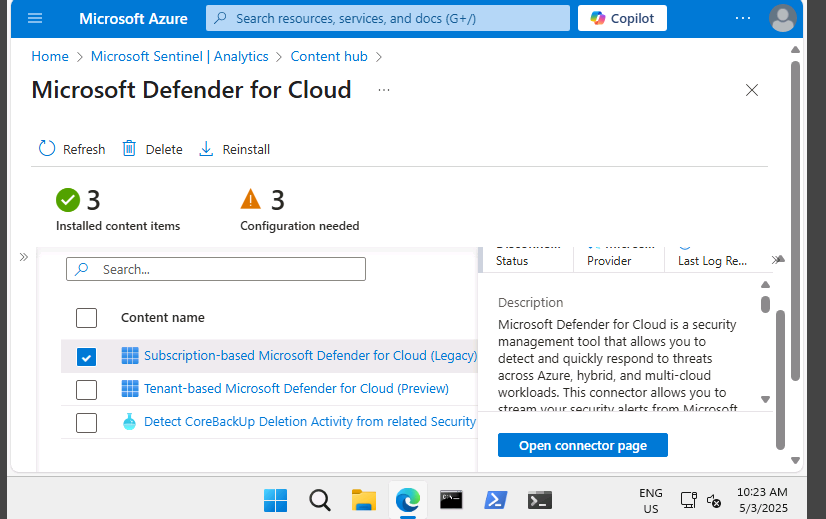
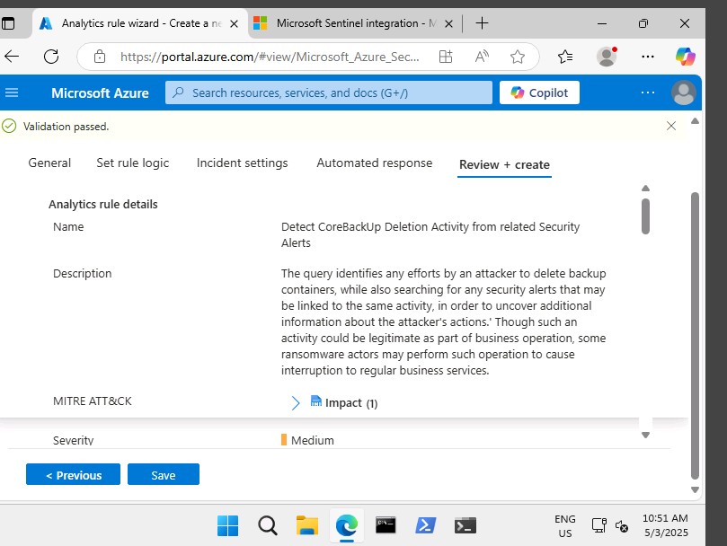

#  Microsoft Sentinel Lab Documentation

About This Project
This project is part of my practical lab work under the Certified Microsoft Security Specialist track, a program delivered through the Microsoft ADC and Cyber Shujaa initiative. It focuses on hands-on experience with Microsoft Security tools and solutions, and supports two key certifications:

SC-900: Microsoft Security, Compliance, and Identity Fundamentals

AZ-500: Microsoft Azure Security Technologies

The lab documented here specifically explores the capabilities of Microsoft Sentinel, including data collection, detection, investigation, and response within a cloud-based SIEM (Security Information and Event Management) solution.
##  Introduction
This lab explores **Microsoft Sentinel**, a cloud-native SIEM and SOAR solution in Azure. The goal is to simulate a real-world setup for monitoring and securing cloud environments through intelligent data collection, alerting, investigation and automated response.

---

##  Objectives
- Deploy and configure Microsoft Sentinel.
- Connect Sentinel to Microsoft Defender for Cloud.
- Set up built-in analytics rules.
- Explore incident response tools, MITRE ATT&CK mapping, threat intelligence and automation.

---

##  Task 1: Create a Microsoft Sentinel Instance

1. Searched for **Microsoft Sentinel** in Azure Portal.
2. Created a **Log Analytics Workspace**:
   - Name: `SC900-LogAnalytics-workspace`
   - Resource Group: `SC900-Sentinel-RG`
   - Region: `East US`
3. Activated the Microsoft Sentinel free trial.

 _Screenshot: Microsoft Sentinel deployment page_  
``
``

---

## Task 2: Assign Access Control (IAM) Roles

1. Navigated to `Access control (IAM)` in the resource group.
2. Verified personal access under **View my access**.
3. Reviewed built-in roles like:
   - Microsoft Sentinel Contributor
   - Microsoft Sentinel Responder

 Followed the principle of **least privilege**.

 _Screenshot: IAM roles view_  
``

---

##  Task 3: Connect Sentinel to Defender for Cloud

1. Went to **Content Hub** in Sentinel.
2. Installed the **Microsoft Defender for Cloud** content pack.
3. Activated built-in analytics rule:
   - Name: *Detect CoreBackUp Deletion Activity*
4. Saved the rule.

 _Screenshot: Analytics rule activation_  
`
`

---

##  Task 4: Explore Sentinel Features

- Visited **Threat Management**:
  - Incidents, Hunting, Notebooks, Threat Intelligence.
- Reviewed MITRE ATT&CK mapping.
- Explored Automation and default rules.
- Reviewed Playbooks under Automation.

 _Screenshot: MITRE ATT&CK interface_  
``

---

##  Summary

| Capability                | Description                                  |
|---------------------------|----------------------------------------------|
| Data Collection           | Connected via Microsoft Defender for Cloud. |
| Real-time Detection       | Built-in analytics rules.                    |
| Investigation             | Incidents, Notebooks, MITRE ATT&CK.         |
| Automated Response        | Playbooks, automation rules.                |

---

##  Folder Structure Example
project-root/
│
├── README.md
├── images/
│ ├── task1_create_sentinel.png
│ ├── task2_iam_roles.png
│ ├── task3_analytics_rule.png
│ └── task4_mitre_attack.png
